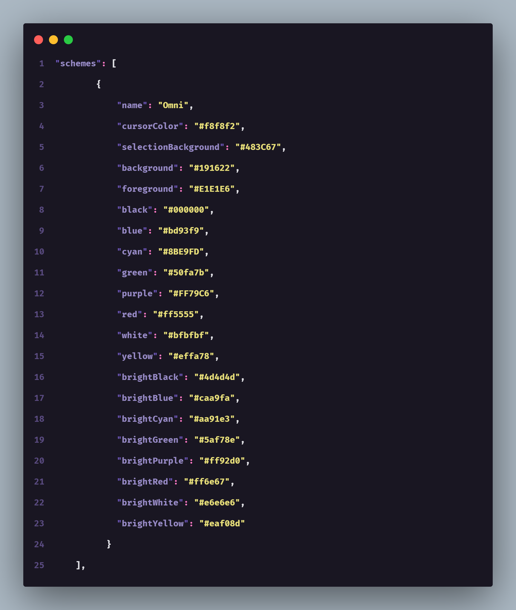

### [Windows Terminal](https://www.microsoft.com/p/windows-terminal/9n0dx20hk701)

#### Install using Git

If you are a git user, you can install the theme by cloning the repo:

    $ git clone https://github.com/getomni/windows-terminal.git omni-windows-terminal

#### Install manually

Download using the [GitHub .zip download](https://github.com/getomni/windows-terminal/archive/master.zip) option and unzip them.

#### Activating theme

- Open the downloaded folder, and copy the content of the file **omni-for-windows-terminal.json**

- Open your Windows Terminal and go to Tab > Settings

- On settings.json, paste the copyed content on "schemes" array, like this:


- Still in the settings.json file, go to "defaults" on "profile", and active the theme and styled tab color: <br/>
```"scheme": "Omni",``` <br/>
```"tabColor": "#191622"```

- Enjoy 💙

